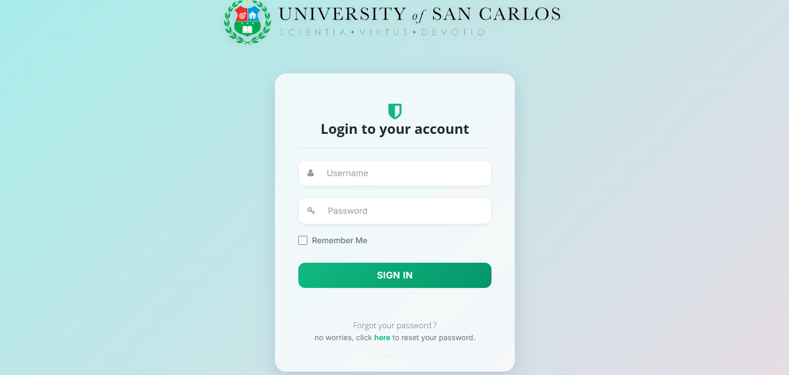
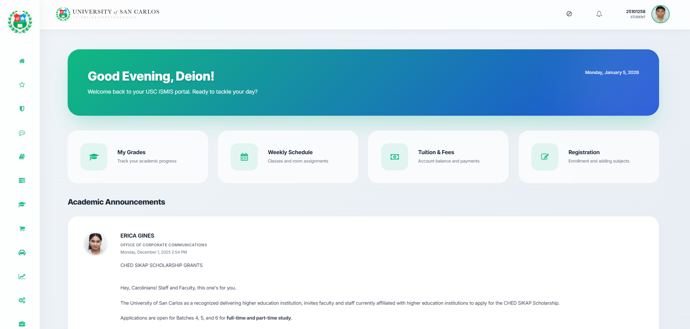
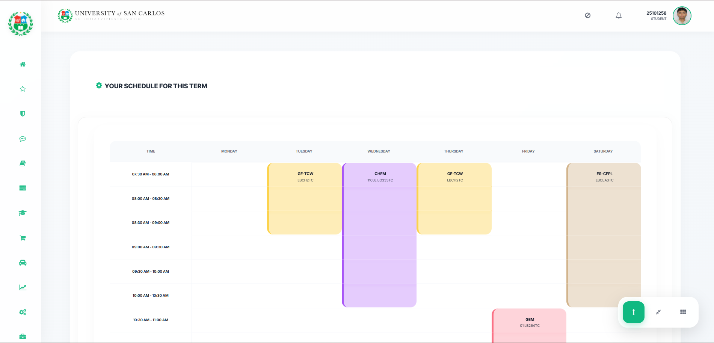

# ISMIS Revamp Suite

A comprehensive UI/UX overhaul for the University of San Carlos Integrated Student Management Information System (ISMIS). This suite transforms the legacy portal into a high-efficiency professional environment.

## 🚀 One-Click Installation

The **Unified Bundle** includes all modernization features (Login, Grades, Schedule, Tuition) in a single script.

1.  **Install Tampermonkey**: [Chrome](https://chrome.google.com/webstore/detail/tampermonkey/dhdgffkkebhmkfjojejmpbldmpobfkfo) | [Firefox](https://addons.mozilla.org/en-US/firefox/addon/tampermonkey/) | [Edge](https://microsoftedge.microsoft.com/addons/detail/tampermonkey/iikmkjmpaadaobahmlepbluegdocjnii)
2.  **Add the Script**: Click the link below:

**[👉 Install ISMIS Revamp Bundle (v1.3)](https://github.com/25101258-cpu/uscismisrevamp/raw/refs/heads/main/ISMIS_Revamp_Bundle.user.js)**

## 📸 Preview

*Experience the transformation of the USC ISMIS portal.*

| Login Page | Dashboard | Weekly Schedule |
| :---: | :---: | :---: |
|  |  |  |
| *Modern Glassmorphism Login* | *Luxury Hero & Sidebar* | *Interactive Timetable* |

---

## ✨ Integrated Modules

| Module | Features |
| :--- | :--- |
| **Login** | Glassmorphism UI, Auto-Login, "Remember Me" logic. |
| **Dashboard** | Modern Topbar, Sidebar with recognizable icons, Hero greeting. |
| **Grades** | Academic Dashboard, GWA/GPA calculation, course cards. |
| **Schedule** | Interactive Weekly Timetable with room highlighting. |
| **Tuition** | Financial KPI cards, modernized assessment tables. |

## 🛠 Features

### 1. **Intelligent Global Navigation**
*   **Glassmorphism Sidebar**: Sleek, translucent system responding to user focus.
*   **Dynamic Icon Mapping**: Context-aware icons for Grades, Assessment, etc.
*   **Refined Topbar**: Modernized header prioritizing Student ID.

### 2. **Personalized Dashboard**
*   **Command Center**: Time-aware greeting system with luxury gradients.
*   **Identity Extraction**: Advanced scraping for a personalized experience.
*   **Real-Time Data Sync**: `MutationObservers` for updates without refreshes.

### 3. **Academic & Financial Mastery**
*   **Modernized Interface**: Data tables transformed into high-readability cards.
*   **Automated Logic**: GWA/GPA calculations and financial KPI tracking.
*   **Workflow Smoothing**: Silent background handling of Data Privacy modals.

---
*Developed for a more efficient and visually stunning academic experience.*
